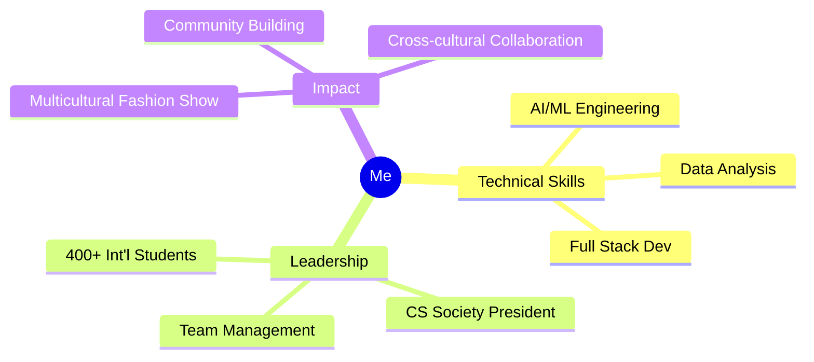

# 👋 Hey, I'm [Mahadi Hossain Aryan ]

### CS + Data Science @ Luther College | AI/ML Engineer in the making

---

## 🛠️ Tech Arsenal

**Focus Areas:** 🤖 AI/ML Engineering • 📊 Data Analysis • 🎯 Predictive Modeling

---

## 🚀 Featured Project

<table>
<tr>
<td width="50%">

### 🏠 NY House Price Predictor

Built an ML model predicting housing prices across **16 NY counties** - from Manhattan to upstate regions.

**Tech Stack:**  
`Python` `scikit-learn` `pandas` `numpy`

**Impact:**  
Analyzed geographic & economic patterns driving property values across diverse markets

</td>
<td width="50%">

</td>
</tr>
</table>

---

## 🌟 Leadership & Impact

### 👥 What Makes Me Different

- **President, International Students Allies & Association**  
  Leading 400+ students • Organized multicultural fashion show celebrating 20+ countries
  
- **President, Computer Science Society**  
  Building technical community • Managing teams of 5 • Driving innovation

> *I don't just code—I build teams that ship. The best solutions come from diverse minds working together.*

---

## 📊 GitHub Stats

---

## 💭 Philosophy

**Code is collaborative. Innovation is diverse. Impact is intentional.**

*Open to internship opportunities, collaborations, and conversations about AI/ML*

